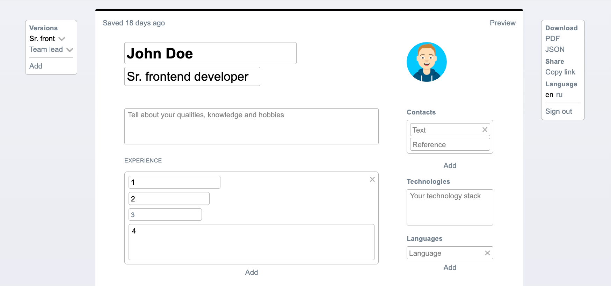

# Cute CV

Simple and easy CV editor.



## Features

📄 **Download PDF**

You can download your CV as a PDF file. To do this, use `PDF` button on the toolbar.

☁️ **Auto saving**

You can finish your CV later. All changes are automatically saved.

👌 **Supporting English and Russian languages**

You can make CV with English or Russian section titles. To toggle language, use `en` or `ru` buttons on the toolbar.

💥 **Markdown in textarea**

You can use `markdown` syntax in a textarea (field where is supported multiline text).
So you can add refs, highlight words, even insert pictures. For example, to add this ref [My GitHub profile](https://github.com/yurimikushov) you should write like this `[My GitHub profile](https://github.com/yurimikushov)`.

## Dev

This's monorepository that has frontend and backend apps. Frontend app provide UI for editing a CV, downloading a PDF file. And backend app provide REST API for getting and saving a CV.

This project is being linted and formatted on the git `pre-commit` phase by `husky`, `eslint` and `prettier`.
And `[front]` and `[back]` prefixes are added to commit messages on the git `commit-msg` phase by `husky` and custom script.

Clones this repository

```
git clone https://github.com/yurimikushov/cute-cv.git
```

Prepares `husky` settings

```
npm run prepare
```

Installs frontend and backend deps including `eslint` and `prettier`

```
cd projects/frontend
npm i

cd ../../projects/backend
npm i
```

## Plans/Ideas

### Share CV via link

I think it's a good idea to be able to share a composed CV with other people via a link. Just imagine a situation where you can share your CV without saving it as PDf file. Sometimes this ability can save time.

## License

Cute CV is [MIT licensed](LICENSE).
